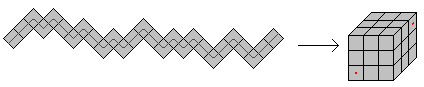

SnakeCube
=========

**Snake Cube puzzle solver**

The snake cube is a mechanical puzzle, a chain of 27 or 64 cubelets,
connected by an elastic band running through them.
The cubelets can rotate freely. The aim of the puzzle is to arrange
the chain in such a way that they will form 3x3x3 or 4x4x4 cube
(cf. [Snake Cube on Wikipedia](http://en.wikipedia.org/wiki/Snake_cube)).

This program finds a solution and translates it into natual language
instructions on how to apply it.

*Example of a 3x3x3 snake cube*

Implementation
--------------

The Haskell implementation is based on a "speed coding contest" of some sort.
A friend of mine had a 4x4x4 snake cube puzzle at home, and I bet him I could code
a solver faster than he could solve the actual puzzle (he's really good
at solving those things BTW).

Unfortunately, when writing down the cubelet segment lengths, I must have
had a typo somewhere, since the program wouldn't find any solution. So we
had to abandon the contest, as he had almost solved the puzzle, and would
have had to start from scratch for me to recount the cubelets... but I
guess otherwise I would've won ;)

That's also why the program's text output is in my native tongue German.
Don't worry thou, code is commented, nothing is left unclear.

This version is optimized a little for speed by using a hashset data
structure and unboxed data types for integer arithmetic (execution time
for 4x4x4 cube is ~13s on my machine). Also, now a solvable version of
a 4x4x4 cube is included. 
See comments in the program text if you want to know more.

I release it to anyone who has a puzzle like that sitting on their shelf
and keep having it in a state of disorder after ppl visit :)
